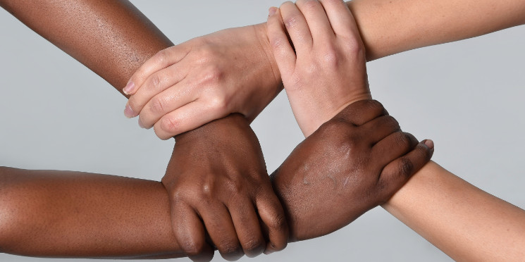

<!DOCTYPE HTML>
<html lang="pt-br">
<head>
  <meta charset="UTF-8">
  <meta name="HandheldFriendly" content="true" />
  <meta name="viewport" content="width=device-width, height=device-height, user-scalable=no" />
    <title>Conscientizando</title>
    <link rel="stylesheet" type="text/css"  href="css/style.css" />

</head>
<body background-color: #191970>
<nav>
  <ul class="menu">
	<li><a href="#" <button onclick="window.location.href = 'index.html'"</button>Home</a></li>
		<li><a href="#">Imagens</a></li>
			  <li><a href="#">Trabalhos</a>
			<ul>
                          <li><a href="#" <button onclick="window.location.href = 'desenhos.html'"</button>Desenhos</a></li>
                          <li><a href="#" <button onclick="window.location.href = 'videos.html'"</button>Videos</a></li>
                          <li><a href="#" <button onclick="window.location.href = 'hq.html'"</button>Historias HQ</a></li>
                          <li><a href="#" <button onclick="window.location.href = 'img.html'"</button>Imagens</a></li>
				   </ul>
		<li><a href="#" <button onclick="window.location.href = 'livros.html'"</button>Livros</a></li>
		<li><a href="#" <button onclick="window.location.href = 'faleconosco.html'"</button>Fale Conosco</a></li>
</ul>
</nav>

</body>
</html>
